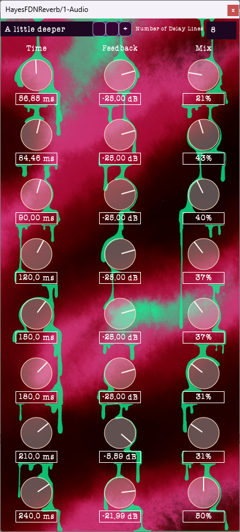

# HayesFDNReverb
A free, open-source feedback-delay network reverb with 9 all-pass diffusers, 8 delay lines, and some light filtering.
This is a commonly-used technique to create perfect-sounding reverbs, although they can sometimes be tricky to get to sound realistic.
Written with JUCE.

