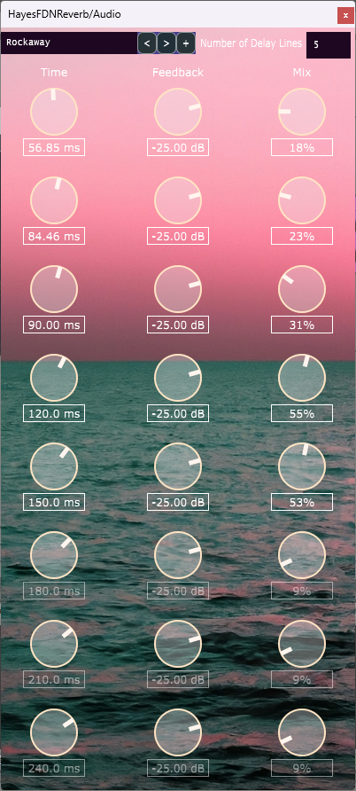

# HayesFDNReverb
A feedback-delay network reverb with 9 all-pass diffusers and 8 delay lines.

This is a commonly-used technique to create perfect-sounding reverbs, although they can be tricky to get to sound realistic.
Future plans for this reverb include parameterizing the diffusion layers as well as the number of delay lines.

